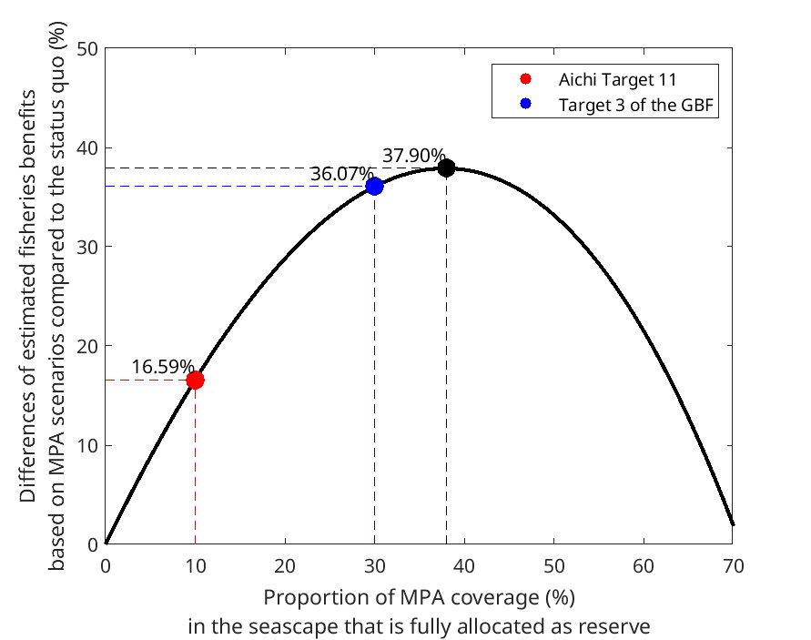
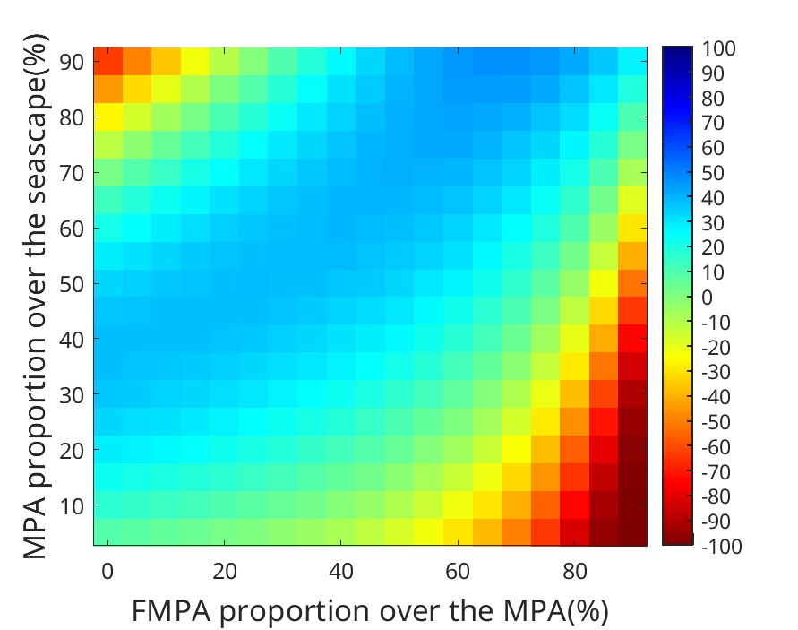
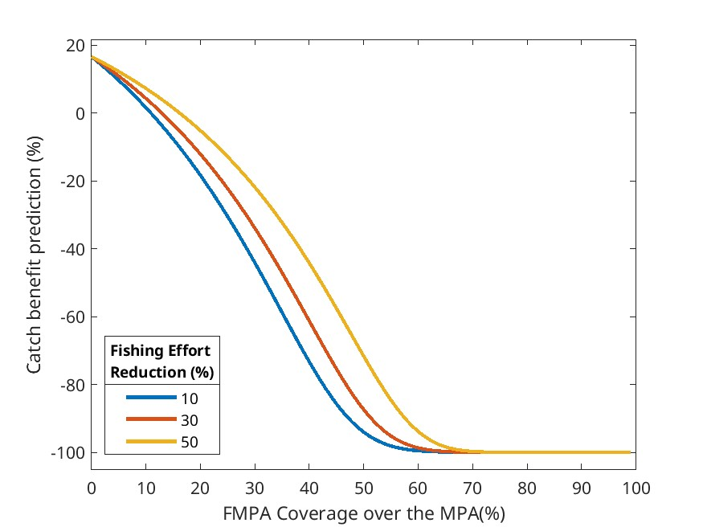
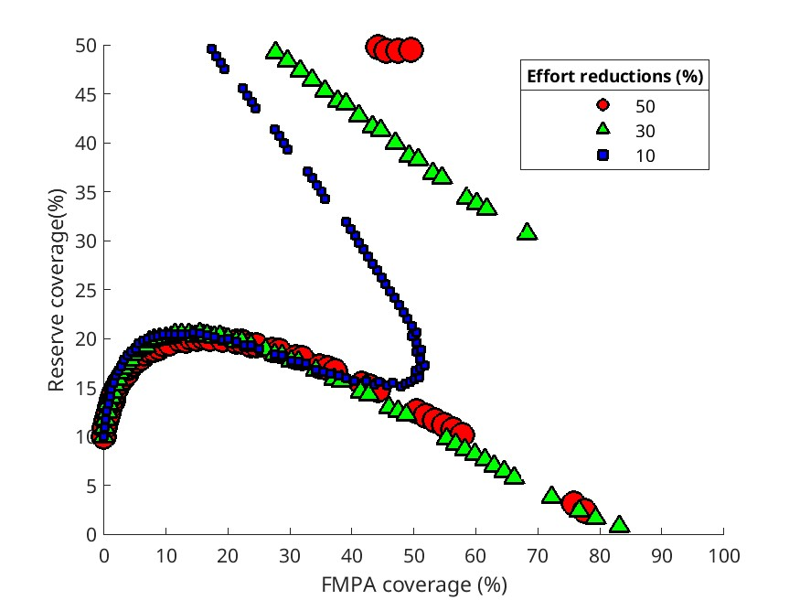

# MPA_targets
This repository was created to accompany the paper "Diversifying Global Biodiversity MPA Targets," specifically addressing Aichi Target 11 and Target 3 of the Global Biodiversity Framework (GBF).

This paper explores the diversity of MPA (Marine Protected Area) target implementations and predicts their catch benefits given different MPA designs and fishing pressure reductions.

## Initial Setups
### A. Check all defined parameters in [`spparams_v3`](mains/spparams_v3.m).
The parameters are set for four reef fish species: 
1) Parrotfish (*Scarus* spp.)
2) Snapper (*Lutjanus* spp.)
3) Coral trout (*Plectropomus* spp.)
4) Rabbitfish (*Siganus* spp.)
Beverton-Holt's recruitment parameters α and β are parameterized in this file.

### B. Parameterize EOpt (Optimum Fishing Mortality Rate) that generates COpt (Maximum catch) for each species by running [`SetInits_AgeStructMod_v5`](mains/SetInits_AgeStructMod_v5.m).
This parameterization file is run to obtain the parameters EOpt, which translates to 1×Fmsy (sustainable fishing pressure) under the status quo (SQ) condition where MPAs do not exist.
It will be multiplied by 1.5 and 2.0 to define moderate overfishing and high overfishing, respectively.
This file is run to obtain fishing mortality rates that generate maximum catch for each species by running the age-structured fisheries model ['timeloopfunc'](functions/timeloopfunc.m).
After obtaining Fmsy, MPA scenarios are built by having varied combinations of the proportions of NMPA, reserve, and FMPA, as well as fishing pressure reduction.
The fishing pressure (FP) is defined at the beginning with the following categories: 
1) sustainable (1×Fmsy) 
2) moderate overfishing (1.5×Fmsy)
3) high overfishing (2×Fmsy).
The reduction of fishing pressure is calculated proportionally, e.g., 50% of 2×Fmsy for a 50% reduction.

EOpt (F<sub.msy) for maximum catch for each species:
1) Parrotfish (*Scarus* spp.): 0.2256
2) Snapper (*Lutjanus* spp.): 0.1536
3) Coral trout (*Plectropomus* spp.): 0.2064
4) Rabbitfish (*Siganus* spp.): 0.3995

### C. Run the main script [`tradeoff_simulations`](mains/tradeoff_simulations.m) to simulate fish biomass and catch over time under different MPA scenarios (combinations of NMPA, reserve, and FMPA) and fishing pressure reductions.
The simulation output in the [output folder](output/) is split into 11 .mat files with a two-digit code indicating the remaining fishing pressure rate after the reduction is implemented. For example, *05 indicates 50% of the previous FP remained after the reduction, *00 indicates that FMPA is similar to the reserve where FP becomes zero after the reduction is implemented. In contrast, PPA_equal indicates that when MPA is implemented, FMPA is similar to NMPA, with no difference in FP between the two zones. The fishing pressure displaced from the reserve is evenly distributed in NMPA and FMPA. Meanwhile, *10 indicates that FP in FMPA remains the same as before MPA, assuming that the displaced FP from the reserve moves to NMPA, not to FMPA.

The output files are compiled by running the script [`trade_off_scenarios_result_compilation`](mains/trade_off_scenarios_result_compilation.m). It creates a single struct output file named [`trade_off_scenarios_results.mat`](mains/trade_off_scenarios_results.mat).

### Plots 

run ['plot_reserve_catchdiff'](mains/plot_reserve_catchdiff.m) to plot the difference in catch between reserve and status quo over time.

run ['plot_heatmap_fmpa_mpa'](mains/plot_heatmap_fmpa_mpa.m) to plot:
1. heatmap of the difference in catch benefits for various MPA coverage and diverse FMPA proportions

2. trade-off between reserve proportion and FMPA proportion

3. Combination of FMPA and Reserve proportions that yield the same catch benefit as a full reserve of 10% or 30% in a seascape
 
